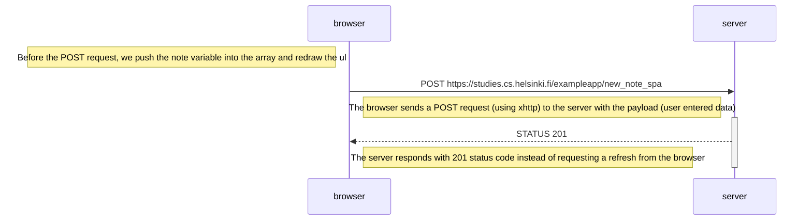

```mermaid
sequenceDiagram
    participant browser
    participant server
    
    note left of browser: Before the POST request, we push the note variable into the array and redraw the ul
    browser->>server: POST https://studies.cs.helsinki.fi/exampleapp/new_note_spa
    note right of browser: The browser sends a POST request (using xhttp) to the server with the payload (user entered data)
    activate server
    server-->>browser: STATUS 201
    note right of browser: The server responds with 201 status code instead of requesting a refresh from the browser
    deactivate server
      
```